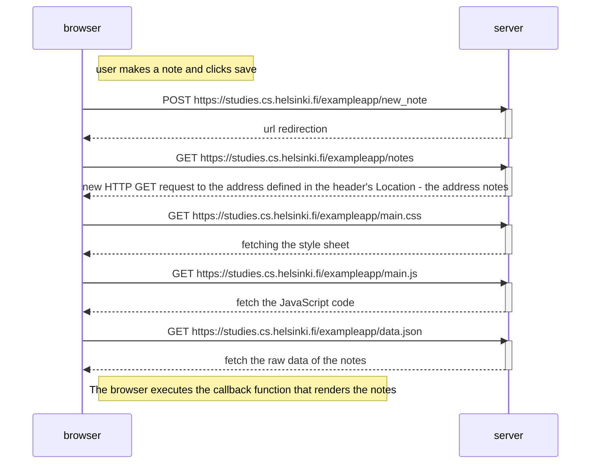

```mermaid
sequenceDiagram
    participant browser
    participant server
    
    Note right of browser: user makes a note and clicks save

    browser->>server: POST https://studies.cs.helsinki.fi/exampleapp/new_note
    activate server
    server-->>browser: url redirection
    deactivate server

    browser->>server: GET https://studies.cs.helsinki.fi/exampleapp/notes
    activate server
    server-->>browser: new HTTP GET request to the address defined in the header's Location - the address notes
    deactivate server

    browser->>server: GET https://studies.cs.helsinki.fi/exampleapp/main.css
    activate server
    server-->>browser: fetching the style sheet
    deactivate server

    browser->>server: GET https://studies.cs.helsinki.fi/exampleapp/main.js
    activate server
    server-->>browser: fetch the JavaScript code
    deactivate server

    browser->>server: GET https://studies.cs.helsinki.fi/exampleapp/data.json
    activate server
    server-->>browser: fetch the raw data of the notes
    deactivate server

    Note right of browser: The browser executes the callback function that renders the notes
```